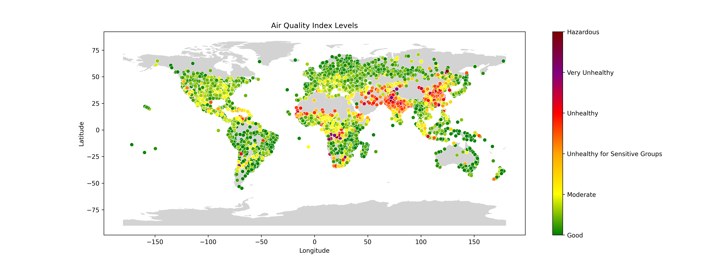

# AQI Visualation
In this project we will try to visualize AQI levels by city and perform EDA (exploratory data analysis) on a dataframe consisting of cities and AQI levels.

## Content Overview
### `aqi_visualization.py`
Using geopandas we overlay a scatterplot of AQI levels by latitude and longitude on a world map.  We create a custom colorbar to match specific AQI levels to the colors defined in [https://www.airnow.gov/aqi/aqi-basics/](https://www.airnow.gov/aqi/aqi-basics/) 

### `aqi_test.py`
We experiment with the data in `AQI and Lat Long of Countries.csv` to get more comfortable with the dataframe and to try and observe any trends which might not be obvious from just seeing AQI levels plotted on a map.  This also provides an opportunity to play around with various tools with pandas.  In particular, we spend time considering how different countries compare by averaging statistics across their cities.

## Dataset
The dataset used in our analysis, `AQI and Lat Long of Countries.csv` by Aditya Ramachandran, can be freely obtained from Kaggle via the following link:

[https://www.kaggle.com/datasets/adityaramachandran27/world-air-quality-index-by-city-and-coordinates](https://www.kaggle.com/datasets/adityaramachandran27/world-air-quality-index-by-city-and-coordinates) 

under the CC BY-NC-SA 4.0 license.
It contains information on AQI levels by city. 

For plotting datapoints on a world map we use `global_geodata` downloaded from:

[https://www.naturalearthdata.com/downloads/110m-cultural-vectors/](https://www.naturalearthdata.com/downloads/110m-cultural-vectors/)

by selecting "Admin 0 – Countries"

## Dependencies
The following python libraries are used in this project.
* `pandas`
* `geopandas`
* `matplotlib`
* `seaborn`
* `numpy` (only for experimenting in `practice.py`)